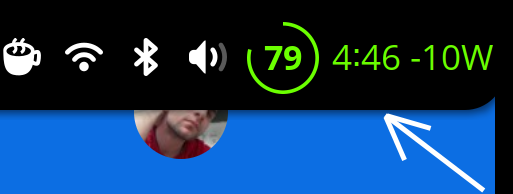

# Battery Power Monitor for GNOME Shell

[](https://github.com/DarkPhilosophy/batt-watt-power-monitor/actions/workflows/ci.yml)
[](https://extensions.gnome.org/extension/9023/battery-power-monitor/)
[](https://www.gnu.org/licenses/gpl-3.0)
<!-- GNOME-SHELL-VERSIONS-START -->
[](https://www.gnome.org/)
<!-- GNOME-SHELL-VERSIONS-END -->

**Battery Power Monitor** - A GNOME Shell extension showing battery percentage, time remaining, and real-time power consumption.

**Status**: **Live** on GNOME Extensions (ID: 9023).

<!-- EGO-VERSION-START -->
[](https://extensions.gnome.org/extension/9023/batt-watt-power-monitor/)  
<!-- EGO-VERSION-END -->

## Features

-   **Battery Percentage**: Shows the current battery percentage.
-   **Time Remaining**: Displays the estimated time remaining until the battery is fully charged or discharged.
-   **Power Consumption**: Shows the current power consumption in Watts.
-   **Indicator**: Shows a simple percentage indicator in the panel (configurable).
-   **Positioning**: Choose to place the indicator on the Left or Right of the QuickSettings area.

## Validation Status

<!-- LINT-RESULT-START -->
### Linting Status
> **Status**: ✅ **Passing**  
> **Last Updated**: 2026-04-13 00:56:21 UTC  
> **Summary**: 0 errors, 0 warnings

<details>
<summary>Click to view full lint output</summary>

```
> batt-watt-power-monitor@22.0.0 lint:fix
> eslint --fix extension .scripts --format stylish
```

</details>
<!-- LINT-RESULT-END -->

<!-- LATEST-VERSION-START -->
<details open>
<summary><strong>Latest Update (v22)</strong></summary>

- **Stock Icon Mode**: Added a new preference to use the native GNOME battery icon instead of the custom bar or circular indicator.
- **Charging Color Tuning**: Colored mode now falls back to the theme foreground while charging, avoiding misleading low-battery red/orange states.
- **Panel Sync**: The stock icon path now respects the same panel visibility flow as the custom indicators.
- **Version Art**: Added a dedicated `v22` SVG concept icon under `assets/`.

</details>
<!-- LATEST-VERSION-END -->




## Configuration

### General

| Setting | Default | Description |
| :--- | :--- | :--- |
| **Interval** | `10` | Refresh rate in seconds. |
| **Show Icon** | `true` | Toggle the panel icon. |
| **Use GNOME Stock Icon** | `false` | Use the default GNOME battery icon instead of the custom bar or circular indicator. |
| **Use Circular Indicator** | `false` | Replace battery icon with a circular meter. |
| **Show Colored** | `false` | Enable colored ring/text. Charging falls back to the theme color instead of warning red/orange. |
| **Show Percentage** | `true` | Show battery percentage text. |
| **Percentage Outside** | `false` | Show percentage text adjacent to the icon. |
| **Time Remaining** | `true` | Show time to full/empty. |
| **Show Watts** | `true` | Show power consumption in Watts. |
| **Show Decimals** | `false` | Show wattage with 2 decimal places. |
| **Hide Charging** | `false` | Hide indicator while charging. |
| **Hide Full** | `false` | Hide indicator when fully charged. |
| **Hide Idle** | `false` | Hide indicator when not charging/discharging. |
| **Battery** | `0` (Auto) | Select battery device (0=Auto, 1=BAT0, etc). |

### Battery Bar / Circular

| Setting | Default | Description |
| :--- | :--- | :--- |
| **Battery Width** | `27` | Width of the battery icon (Bar mode). |
| **Battery Height** | `33` | Height of the battery icon (Bar mode). |
| **Circular Size** | `27` | Diameter of the circular indicator (Circular mode). |

### Debug

| Setting | Default | Description |
| :--- | :--- | :--- |
| **Enable Debug** | `false` | Enable build info and logs. |
| **Force Bolt** | `false` | Always show charging bolt. |
| **Log Level** | `1` | 0=Verbose, 1=Debug, 2=Info, 3=Warn, 4=Error. |
| **Log to File** | `true` | Write debug logs to file. |
| **Log File Path** | `''` | Custom path (empty = default cache). |

## Install

- GNOME Extensions: <https://extensions.gnome.org/extension/9023/batt-watt-power-monitor/>
- Local build:

  ```bash
  ./build.sh
  ```

## Project Docs

- [Changelog](CHANGELOG.md)
- [Contributing](CONTRIBUTING.md)
- [Third-party notices](THIRD_PARTY_NOTICES.md)
- [License](../LICENSE)
