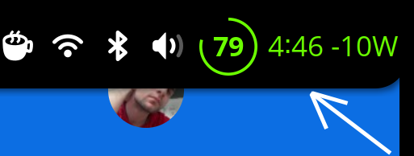

# Battery Power Monitor for GNOME Shell

[](https://github.com/DarkPhilosophy/batt-watt-power-monitor/actions/workflows/ci.yml)

[](https://extensions.gnome.org/extension/9023/battery-power-monitor/) <!-- GNOME-SHELL-VERSIONS-START --> [](https://www.gnome.org/) <!-- GNOME-SHELL-VERSIONS-END -->
[](https://www.gnu.org/licenses/gpl-3.0)

**Battery Power Monitor** - A GNOME Shell extension showing battery percentage, time remaining, and real-time power consumption.

**Status**: **Live** on GNOME Extensions (ID: 9023).

<!-- EGO-VERSION-START -->
[](https://extensions.gnome.org/extension/9023/batt-watt-power-monitor/)  
<!-- EGO-VERSION-END -->

## Features

-   **Battery Percentage**: Shows the current battery percentage.
-   **Time Remaining**: Displays the estimated time remaining until the battery is fully charged or discharged.
-   **Power Consumption**: Shows the current power consumption in Watts.
-   **Indicator**: Shows a simple percentage indicator in the panel (configurable).
-   **Positioning**: Choose to place the indicator on the Left or Right of the QuickSettings area.

## Validation Status

<!-- LINT-RESULT-START -->
### Linting Status
> **Status**: ✅ **Passing**  
> **Last Updated**: 2026-07-20 21:57:27 UTC  
> **Summary**: 0 errors, 0 warnings

<details>
<summary>Click to view full lint output</summary>

```text
> batt-watt-power-monitor@23.0.0 lint
> eslint extension .scripts test --format stylish
```

</details>
<!-- LINT-RESULT-END -->

<!-- LATEST-VERSION-START -->
<details open>
<summary><strong>Latest Update (v23)</strong></summary>

- **Power Reading Fix (#10)**: Fixed wattage getting stuck at a constant, bogus value (e.g. `-7.7 W`) on batteries that expose `power_now` but not `current_now`. The power source is now re-evaluated every cycle (`computePower`) instead of caching a one-shot detection that could be poisoned by the async file-cache race at boot. It falls back to `current_now * voltage_now` only when both are readable, otherwise reports `0` instead of a negative sentinel, and self-corrects once `power_now` resolves.
- **Kebab-case Settings Schema**: Renamed all flat GSettings keys to idiomatic kebab-case (e.g. `showicon` to `show-icon`, `loglevel` to `log-level`). A one-time migration at first enable copies any existing user values straight from dconf into the new keys and then removes the legacy keys, so upgrades keep your configuration.
- **Sanitized Logging**: Every log line is now redacted (Bearer tokens, JWT-like values, access/refresh tokens) and length-capped before being written to the console or a file.
- **Refined About Page**: Dedicated rows with icons for Extension version, Build date, Build ID (debug-gated), Data source, Project Homepage, and Report an Issue.
- **Refined Debug Page**: Added a Diagnostics group - copy sanitized configuration as JSON, and a Recent Log Events viewer showing the last 80 sanitized log lines.
- **Live Debug Toggle**: Changing debug or logging settings now reconfigures the logger immediately instead of requiring a re-enable.
- **Build Tooling Modernized**: Migrated all `.scripts` to ES modules (`.mjs`), made linting blocking, and switched build-metadata injection (`BUILD_DATE` / `BUILD_ID`) to value-agnostic regex so it never depends on a hardcoded placeholder value.
- **Test Suite**: Added Node (`node --test`) and GJS test modules covering credential redaction, log path resolution and formatting, the #10 power selection, constants, utility formatting and colors, plus structural regression guards.

</details>
<!-- LATEST-VERSION-END -->




## Configuration

### General

| Setting | Default | Description |
| :--- | :--- | :--- |
| **Interval** | `10` | Refresh rate in seconds. |
| **Battery Bar Orientation** | `portrait` | Use `portrait` or `landscape` for the battery bar. |
| **Indicator Position** | `right` | Place the indicator on the left, right, or default slot. |
| **Show Icon** | `true` | Toggle the panel icon. |
| **Use Circular Indicator** | `false` | Replace battery icon with a circular meter. |
| **Use GNOME Stock Icon** | `false` | Use the stock GNOME battery icon instead of custom indicators. |
| **Color Gradient Icon** | `true` | Enable the red-to-green gradient for the icon. Disable for themed monochrome. |
| **Charging Icon Color** | `gradient` | Charging override for the icon: `gradient`, `theme`, or `custom`. |
| **Custom Charging Icon Color** | `#ffffff` | Custom icon color used only when charging icon mode is `custom`. |
| **Color Gradient Text** | `true` | Enable the red-to-green gradient for text. Disable for themed monochrome. |
| **Charging Text Color** | `gradient` | Charging override for text: `gradient`, `theme`, or `custom`. |
| **Custom Charging Text Color** | `#ffffff` | Custom text color used only when charging text mode is `custom`. |
| **Text Stroke** | `true` | Draw a dark outline around text and the charging bolt. |
| **Show Percentage** | `true` | Show battery percentage text. |
| **Percentage Outside** | `false` | Show percentage text adjacent to the icon. |
| **Time Remaining** | `true` | Show time to full/empty. |
| **Show Watts** | `true` | Show power consumption in Watts. |
| **Show Decimals** | `false` | Show wattage with 2 decimal places. |
| **Hide Charging** | `false` | Hide indicator while charging. |
| **Hide Full** | `false` | Hide indicator when fully charged. |
| **Hide Idle** | `false` | Hide indicator when not charging/discharging. |
| **Battery** | `0` (Auto) | Select battery device (0=Auto, 1=BAT0, etc). |

### Battery Bar / Circular

| Setting | Default | Description |
| :--- | :--- | :--- |
| **Battery Width** | `34` | Width of the battery icon (Bar mode). |
| **Battery Height** | `40` | Height of the battery icon (Bar mode). |
| **Circular Size** | `36` | Diameter of the circular indicator (Circular mode). |

### Debug

| Setting | Default | Description |
| :--- | :--- | :--- |
| **Enable Debug** | `false` | Enable build info and logs. |
| **Force Bolt** | `false` | Always show charging bolt. |
| **Fake Charging** | `false` | Force synthetic charging state. |
| **Fake Discharging** | `false` | Force synthetic discharging state. |
| **Fake Charge Min** | `50` | Lower bound for synthetic percentage. |
| **Fake Charge Max** | `100` | Upper bound for synthetic percentage. |
| **Log Level** | `1` | 0=Verbose, 1=Debug, 2=Info, 3=Warn, 4=Error. |
| **Log to File** | `true` | Write debug logs to file. |
| **Log File Path** | `''` | Custom path (empty = default cache). |

## Install

- GNOME Extensions: <https://extensions.gnome.org/extension/9023/batt-watt-power-monitor/>
- Local build:

  ```bash
  ./build.sh
  ```

## Project Docs

- [Changelog](CHANGELOG.md)
- [Contributing](CONTRIBUTING.md)
- [Third-party notices](THIRD_PARTY_NOTICES.md)
- [License](../LICENSE)
